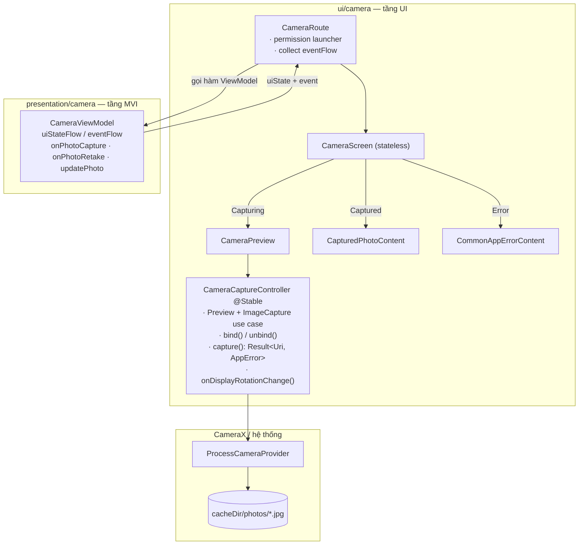
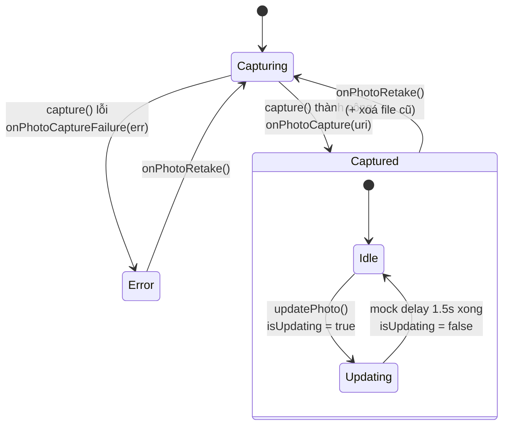
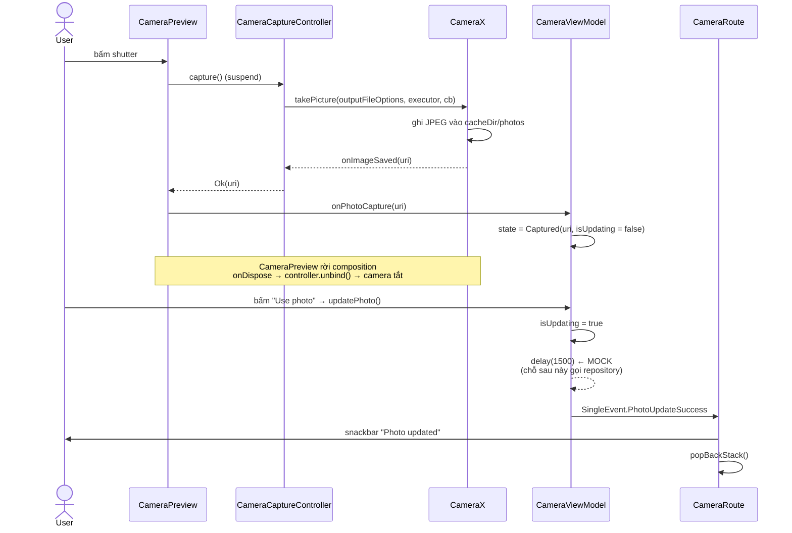
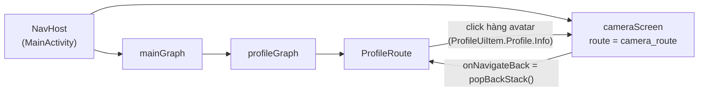
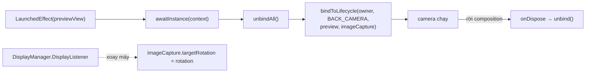
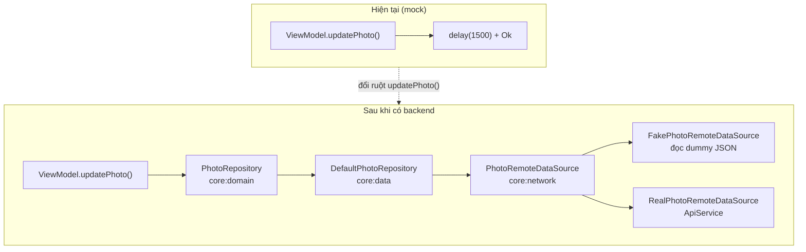

# Feature `camera` — Sơ đồ kiến trúc

Tài liệu mô tả module `feature/camera`: chụp ảnh bằng CameraX → review ảnh → gọi `updatePhoto()` (hiện đang mock).

> Các sơ đồ dưới viết bằng Mermaid — GitHub, VS Code (extension Markdown Preview Mermaid) và IntelliJ đều render được.

---

## 1. Kiến trúc — ai giữ CameraX, ai giữ state



**Vì sao CameraX không nằm trong ViewModel:** `bindToLifecycle()` cần một `LifecycleOwner`, thứ chỉ tồn tại ở tầng UI. ViewModel chỉ nhận `Uri` của ảnh đã lưu — nó hoàn toàn không biết CameraX tồn tại, nên test được và thay được nguồn ảnh bất cứ lúc nào.

---

## 2. State machine



Nguyên tắc phân biệt:

| Thứ | Model ở đâu | Lý do |
|---|---|---|
| `isUpdating` | **UiState** | trạng thái liên tục, phải sống qua recomposition |
| `PhotoUpdateSuccess` / `PhotoUpdateFailure` | **SingleEvent** (EventChannel) | one-shot: snackbar, điều hướng — không được lặp lại khi recompose |

---

## 3. Sequence — từ lúc bấm shutter đến khi bấm "Use photo"



---

## 4. Navigation



Callback `onNavigateToCameraScreen` được truyền xuyên tầng: `MainActivity` → `mainGraph` → `profileGraph` → `ProfileRoute`. Feature không tự giữ `NavController`.

---

## 5. Vòng đời CameraX cần chú ý



| Bẫy | Cách xử lý trong module này |
|---|---|
| Bind lại use case đang bound → exception | luôn `unbindAll()` trước `bindToLifecycle()` |
| CameraX bind theo **lifecycle**, không theo composition → camera vẫn mở khi review ảnh | `DisposableEffect` gọi `controller.unbind()` |
| Activity khoá orientation → ảnh lưu bị lệch 90° | `DisplayListener` cập nhật `targetRotation` |
| `Executor` của `takePicture` bị rò | `Executors.newSingleThreadExecutor()` + `shutdown()` trong `onDispose` |
| Quyền cấp từ màn Settings không được nhận lại | `LifecycleResumeEffect` đọc lại permission mỗi lần resume |

---

## 6. Chỗ sẽ đổi khi có API thật



Chỉ thân hàm `updatePhoto()` thay đổi — UI, state machine và `CameraCaptureController` giữ nguyên. Xem [`.claude/rules/data-layer.md`](../.claude/rules/data-layer.md) cho pattern đầy đủ.

---

## 7. Bản đồ file

```
feature/camera/src/main/
├── AndroidManifest.xml                    CAMERA permission + uses-feature
└── kotlin/.../feature/camera/
    ├── presentation/camera/
    │   ├── CameraContract.kt              UiState (LCE) + SingleEvent
    │   ├── CameraViewModel.kt             updatePhoto() mock nằm ở đây
    │   └── navigation/navigation.kt       CameraRoutePattern, cameraScreen()
    └── ui/camera/
        ├── CameraScreen.kt                CameraRoute + CameraScreen + permission
        ├── CameraCaptureController.kt     toàn bộ CameraX
        └── component/
            ├── CameraPreview.kt           AndroidView + PreviewView + shutter
            ├── CapturedPhotoContent.kt    ảnh + Retake / Use photo
            └── CameraPermissionContent.kt rationale + mở Settings
```
